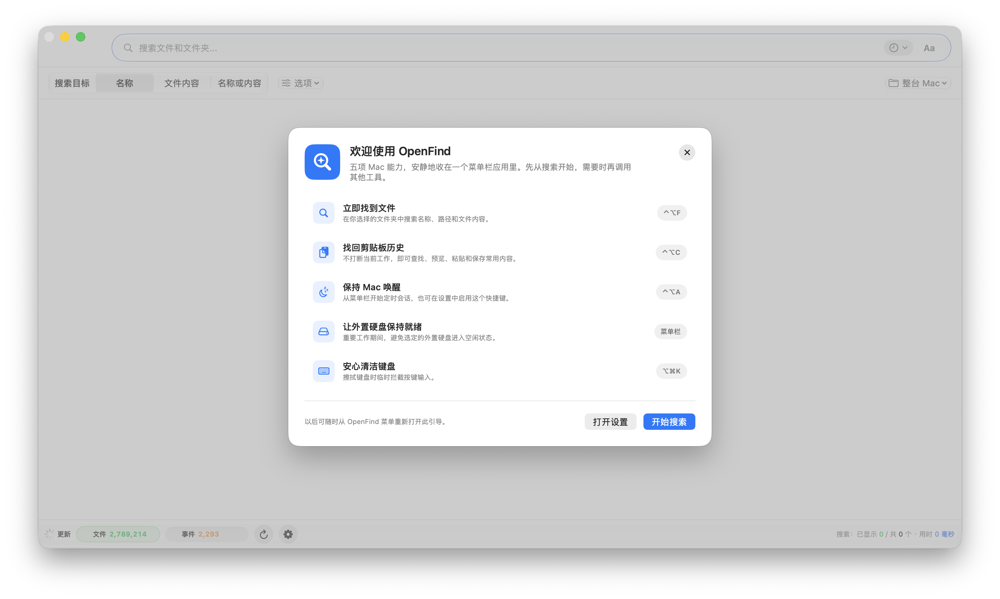
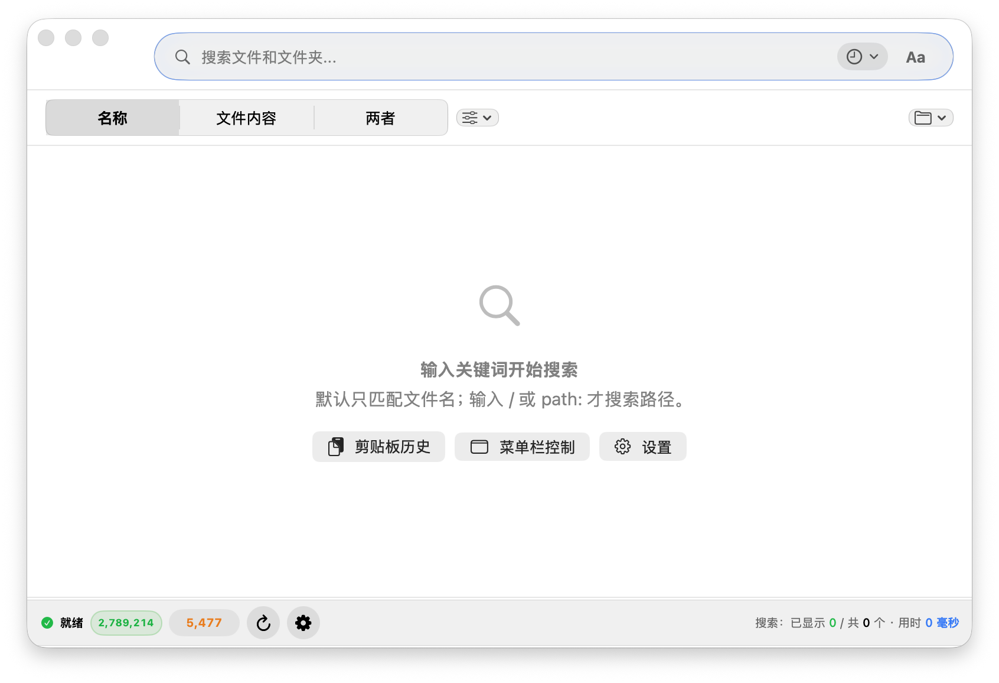
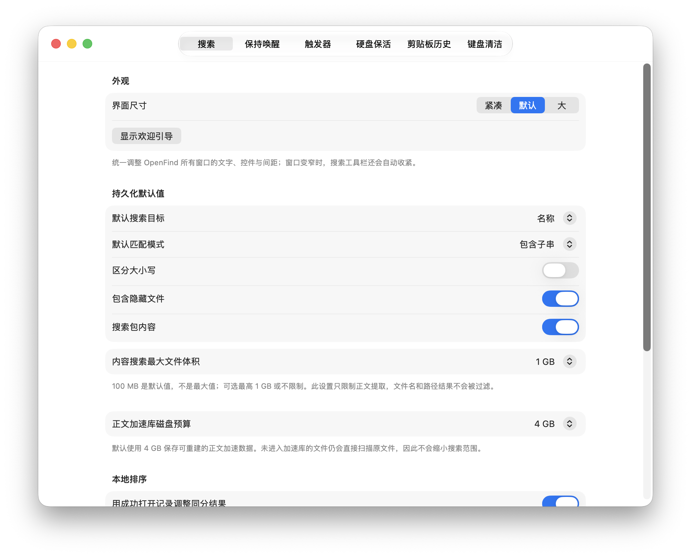
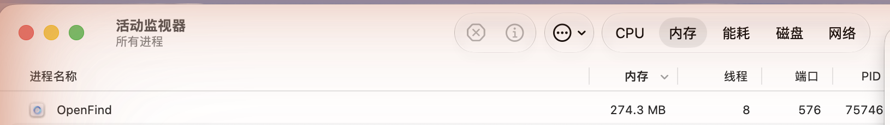

<h2 align="center">🌐 <a href="./README.md">Switch to the English version</a></h2>

# 🚀 OpenFind

[](LICENSE)
[](https://apple.com)
[](https://swift.org)

**一个 App，5 个创造性的工具**  
*毫秒级深层搜索、全加密 OCR 剪贴板、合盖防休眠、外接盘保鲜与键盘锁。*

OpenFind 让你不再被多工具卡顿折磨：**零延迟穿透代码与 ZIP 包**、**复制截图瞬间提取文字且全加密防护**、**合上 MacBook 屏幕编译与下载绝不断开**、**彻底解决外接硬盘与 NAS 假死掉盘**。

[**🚀 立即下载 OpenFind v1.1.2 (macOS Universal)**](https://github.com/GravityPoet/OpenFind/releases/tag/v1.1.2) ·
[查看 v1.1.2 发布说明](https://github.com/GravityPoet/OpenFind/releases/tag/v1.1.2)



| 最小窗口搜索界面 | 统一界面尺寸 |
| :---: | :---: |
|  |  |

---

## 🎯 核心价值

这不是简单的软件拼凑或臃肿替代。OpenFind 将 5 个创造性的工具融为一体，让 5 个常驻工具不再各占一份内存。实测胜于承诺——单进程连续运行 21 小时、搜索索引在线的情况下约 274 MB：



---

## 🔥 为什么你需要 OpenFind？

### 传统工具的臃肿噩梦
为了获得舒适的 macOS 开发体验，开发者通常需要同时安装：
1. **Spotlight 替代品 / 搜索工具**: 索引极其臃肿缓慢，狂占 CPU 和 SSD。
2. **剪贴板管理工具**: 许多第三方剪贴板工具未加密，容易在后台泄露密码与密钥。
3. **防休眠工具 (Amphetamine / Caffeine)**: 缺乏智能自动化，合盖即断开，功能单一。
4. **硬盘防休眠脚本**: 需要单独挂载后台脚本，防止移动硬盘和 NAS 频繁掉盘。
5. **清洁键盘工具**: 为了擦拭键盘或防止猫咪踏过，还需要单独下载键盘锁软件。

### OpenFind 终极解决方案
OpenFind 将这 5 大刚需工具集成为一个统一、隐私优先的 macOS 原生应用，内存与 CPU 占用极低。

---

## 🆚 痛点对比

| 场景 / 特性 | 5 款独立软件组合 (Spotlight + 剪贴板 + 咖啡因等) | OpenFind 极客方案 🚀 |
| :--- | :--- | :--- |
| **系统资源占用** | 🥵 5 个后台进程常驻，各占一份内存与电量。 | 🍃 **单个原生 Swift 引擎**，二进制 `mmap` 索引——连续运行 21 小时实测约 274 MB。 |
| **文件与内容搜索** | ⏱️ 5~10秒扫描；不支持正则、不支持 ZIP 包内搜索。 | ⚡ **毫秒级极速搜索**，代码/PDF/Word，免解压流式穿透 ZIP。 |
| **剪贴板历史** | 🔓 明文存储，存在 API Key 和密码泄露安全隐患。 | 🔐 **AES-GCM 加密存储**，Vision OCR 图片识别，顺序粘贴栈与自动隐私忽略。 |
| **防休眠与合盖运行** | ☕ 手动开关；MacBook 一合盖依然强制休眠断网。 | ☕ **智能防休眠**，支持**合盖保持运行 (Clamshell Mode)** 与条件触发。 |
| **外接硬盘健康** | 🛑 移动硬盘频繁休眠、卡死 Finder 或自动断开。 | 💾 **DriveAlive 心跳保鲜**：定期微写，防止 SSD/HDD/NAS 掉盘。 |
| **键盘清理维护** | 🧼 还要再下载一个第三方小工具来锁定键盘。 | 🔒 **快捷键一键锁定键盘**，轻松清洁键帽或防止猫咪踩踏误触。 |

---

## ✨ 一个 App，5 个创造性的工具

### 1. ⚡ 极速搜索引擎 (文件与全文)
* **瞬时 `mmap` 索引**: 微秒级加载数百万路径，零堆内存开销。
* **实时 FSEvents 同步**: 自动监听终端变化（如 `git pull` / `touch`），变动实时生效。
* **深空内容提取**: 深度检索 PDF、Word/Excel、iWork，免解压直接在内存中流式遍历 `.zip` / `.tar.gz` 压缩包。
* **正则、Glob 与快速预览**: 支持 `src/**/*.swift` 与 `regex:^Report-[0-9]+$`，选中按 `Space` 空格键调起原生 Quick Look。

### 2. 📋 加密剪贴板历史与 OCR 识别
* **加密 SQLite 数据库**: 采用 AES-GCM 加密，密钥存于 macOS 钥匙串，安全保护隐私历史。
* **Vision 框架 OCR 文字识别**: 复制任何截图，OpenFind 自动识别图片中的文字并支持搜索。
* **顺序粘贴栈 (Paste Stack)**: 连续复制 10 条内容，通过快捷键按顺序一次性连续粘贴。
* **Snippet 片段快捷替换**: 常用文本固定，自动排除 1Password、Keychain 等敏感应用。
* **唤醒即双栏预览**: 剪贴板历史会同时显示列表和当前项目预览，并记住你调整后的窗口大小。

### 3. ☕ 智能防休眠与合盖运行 (Clamshell Mode)
* **系统/屏幕防休眠**: 自定义时长或无限期保持 Mac 处于唤醒状态。
* **合盖模式 (Clamshell Mode)**: 即使合上 MacBook 屏幕，后台脚本、服务器或编译任务依然持续运行。开关时底层执行 `pmset disablesleep`，macOS 会弹出管理员密码请求。
* **自动化条件触发**: 依据 14 种条件自动触发防休眠——指定 App 运行、下载进行中、CPU 占用、Wi-Fi/VPN 网络、外接显示器、USB/蓝牙设备、时间表等。
* **低电量保护**: 当电池电量低于设定阈值时，自动恢复正常休眠以节省电量。
* **Amphetamine 兼容 AppleScript**: 实现了 Amphetamine 的 AppleScript 命令集，现有防休眠自动化脚本可直接使用（与 Amphetamine 无关联）。

### 4. 💾 DriveAlive 外接硬盘保鲜
* **防止硬盘掉盘**: 后台定时微写心跳脉冲，防止外接移动硬盘、SSD 或 NAS 进入休眠。
* **告别 Finder 卡顿**: 彻底解决访问外接盘时 5 秒以上的唤醒延迟和假死现象。

### 5. 🔒 一键键盘锁
* **一键安全清理**: 快捷键瞬间锁定所有键盘输入，方便清理键盘键帽，或防止宠物踏过造成误操作。

---

## ⚡ 极简上手 (60 秒)

> **前置要求**：macOS 14.0+ (Sonoma 或更高版本) · 支持 Apple 芯片和 Intel Mac · 源码构建需 Swift 6.0 / Xcode 16+

### 运行 CLI 命令行模式
```bash
# 1. 克隆并进入仓库
git clone https://github.com/GravityPoet/OpenFind.git && cd OpenFind

# 2. 使用 macOS 14+ SDK 编译
xcrun --sdk macosx swift build

# 3. 瞬时搜索包含 "OpenFind" 的 Swift 代码
xcrun --sdk macosx swift run OpenFind --search "ext:swift content:OpenFind"
```

### 通过 Homebrew 安装

```bash
brew install --cask GravityPoet/tap/openfind
```

### 安装已签名的 GUI 正式版

1. 从 [最新 GitHub Release](https://github.com/GravityPoet/OpenFind/releases/latest)
   下载 `OpenFind.zip` 与 `OpenFind.zip.sha256`。
2. 将两个文件放在同一目录并校验下载：

```bash
shasum -a 256 -c OpenFind.zip.sha256
```

3. 双击 ZIP 解压，把 `OpenFind.app` 移入 **“应用程序”**，然后从
   **Finder → 应用程序** 打开 OpenFind。
4. 如果 macOS 拦截首次启动，请关闭提示并打开
   **“系统设置 → 隐私与安全性”**，在 **“安全性”** 区域点击 OpenFind
   旁边的 **“仍要打开”**，最后确认 **“打开”**。

> **“仍要打开”只会在 OpenFind 被拦截过一次后出现，通常只需操作一次。**
> 如果没有看到，请先从“应用程序”尝试打开一次 OpenFind，再返回“隐私与安全性”。

如需从源码构建，请克隆仓库后运行 `bash Scripts/build_customer_app.sh`；
维护者可用 `bash Scripts/install_local_app.sh` 原子安装。

---

## ⚙️ 快捷键与查询命令语法示例

```text
# --- 搜索语法示例 ---
*.pdf briefing          # 文件名包含 briefing 的 PDF
type:code openfind      # 包含 openfind 的代码文件
regex:^Report-[0-9]+$   # 正则匹配文件名
content:"API_SECRET"    # 深层全文检索（支持代码、PDF 及 ZIP 包内）
in:/Users/me/Projects   # 在指定目录下递归搜索
tag:Project;Important  # Finder 标签过滤
size:>10mb dm:today     # 按大小与修改 (dm:) / 创建 (dc:) 日期过滤
report AND NOT draft    # 布尔运算符：AND / OR / NOT

# --- 快捷键 ---
⌃⌥F                     # 唤起/隐藏 OpenFind 搜索框
Space (选中结果时)       # 调起原生 Quick Look 快速预览
```

---

## 🏗️ 架构与隐私保障

OpenFind 使用 **Swift 6 & SwiftUI** 构建，严格遵循隐私第一原则：
* **100% 本地运行**: 零追踪、零云端分析。唯一网络行为是通过 Sparkle 向 GitHub Releases 检查更新，且可关闭。
* **单向数据流架构**: `Views -> State -> Engine -> Models` 清晰分离。
* **进程隔离提取**: 压缩包解压与文本提取在隔离的辅助进程中进行，并受输出量与时限约束。

---

## 📦 打包与签名

官方 v1.1.2 客户包同时支持 `arm64` 与 `x86_64`，并使用 OpenFind 固定客户
证书签名。该版本尚未经过 Apple 公证，首次启动按上方说明放行属于预期流程。

```bash
# 固定客户证书发布构建
bash Scripts/build_customer_app.sh

# 维护者可选：Developer ID 签名与 Apple 公证
SIGN_IDENTITY="Developer ID Application: Your Name (TEAMID)" \
  NOTARIZE=1 \
  NOTARY_PROFILE="openfind-notary" \
  bash Scripts/build_app.sh
```

---

## ⚖️ 许可与商业授权

OpenFind 社区版基于 **[AGPL-3.0 License](./LICENSE)** 协议开源。

- **开源免费使用**：任何个人和企业均可按照 AGPL-3.0 协议规定**免费使用与分发**。
- **商业免开源许可**：如果您或您的企业需要将本软件**闭源集成、免除 AGPL-3.0 开源义务或获取专有再分发权**，请联系我们购买 [商业许可 (Commercial Dual-License)](mailto:moonlitpoet@proton.me)。详见 [COMMERCIAL_LICENSE.md](./COMMERCIAL_LICENSE.md)。
- **贡献者协议 (CLA)**：为了维护双重许可的合法性，所有外部 PR 提交前均须签署 CLA。详见 [CONTRIBUTING.md](./CONTRIBUTING.md)。
- **商标声明**：详见 [TRADEMARKS.md](./TRADEMARKS.md)。
